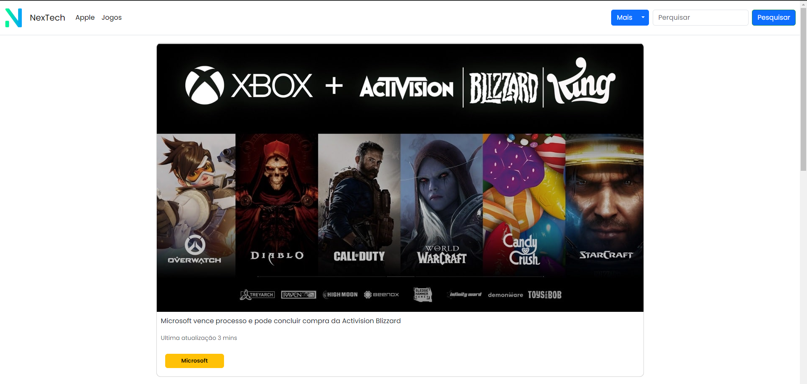

# Site de um templete de blog

## Sobre o projeto 📚

Este projeto foi desenvolvido com o intuito de colocar em prática os conhecimentos adquiridos em HTML,CSS, JS e Bootstrap.

## Tecnologias utilizadas 🚀

- HTML
- CSS
- JS
- Bootstrap

<a href="https://andreimartinscoelho.github.io/Templete-Blog/" alt="link do blog fake">Link do projeto...</a>

## Preview do projeto 🖥️

